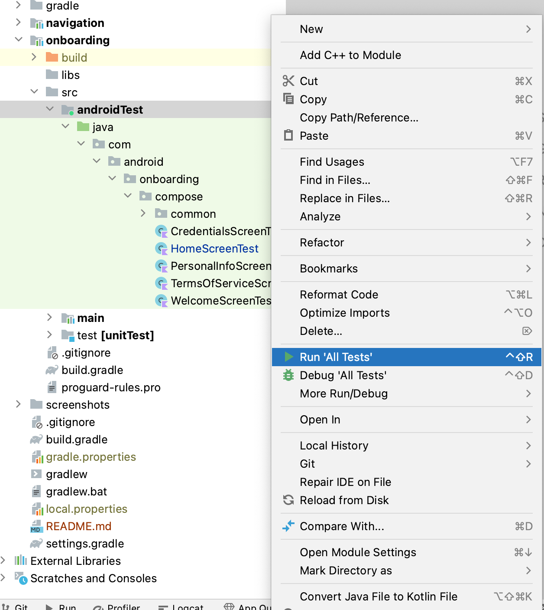

<h1 align="center">JetPack Compose Navigation App</h1>

  
This application is designed to use the latest Android Jetpack compose Navigation Controller component.

  
  

## Download
Go to the [Demo APK](https://github.com/yash786agg/Navigation-App/tree/master/demo_apk) to download the latest APK.

## Tech stack & Open-source libraries
- Minimum SDK level 26
- [Kotlin](https://kotlinlang.org/) based + [Coroutines](https://github.com/Kotlin/kotlinx.coroutines) for asynchronous.
- JetPack
    - [Compose](https://developer.android.com/jetpack/compose) - Android’s recommended modern toolkit for building native UI
    - [ViewModel](https://developer.android.com/topic/libraries/architecture/viewmodel) - UI related data holder, lifecycle aware.
- Architecture
  - MVVM Architecture

Above Features are used to make code simple, generic, understandable, clean and easily maintainable
for future development.

## Automated test

To run Android tests in a directory, right-click on the onboarding androidTest directory and select Run tests

  

## Running and Building the application

You can run the app on a real device or an emulator.

* __[Run on a real device](https://developer.android.com/training/basics/firstapp/running-app#RealDevice)__
* __[Run on an emulator](https://developer.android.com/training/basics/firstapp/running-app#Emulator)__

# Prerequisites
* __Android Studio Arctic Fox | 2023.1.1__
* __Gradle version 8.0.1__
* __Kotlin version 1.7.20__
* __Android Device with USB Debugging Enabled__

# Built With

* __[Android Studio](https://developer.android.com/studio/index.html)__ - The Official IDE for Android
* __[Kotlin](https://developer.android.com/kotlin)__ - Language used to build the application
* __[Gradle](https://gradle.org)__ - Build tool for Android Studio
